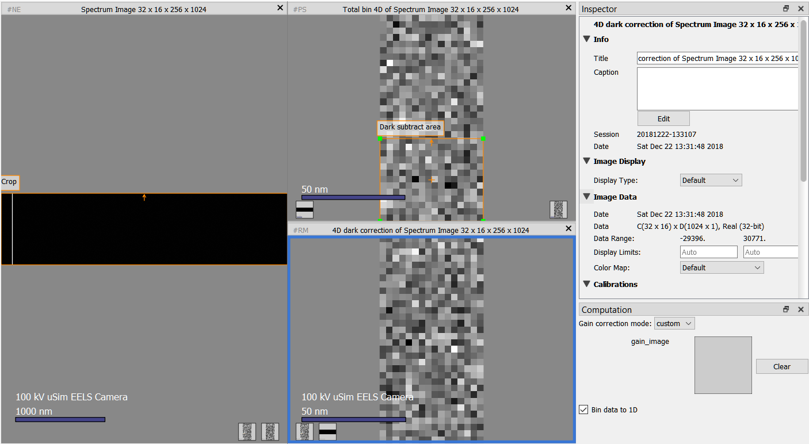

4DTools
============

A collection of plug-ins for Nion Swift¹ specialized in processing of 4D datasets. See "Usage" section below for further information on how to use them.

__________________________________________________________

Usage
======
Within Swift you can launch each plug-in by first selecting the source data item (click on it) and the executing the respective "4D Tools -> Plug-in name" menu item. All parameters that can be changed for the plug-ins will be accessible in the "Inspector" panel.

__________________________________________________________


Map 4D
----------
### Summary
This plug-in will display a rectangle region in the Source data item and plot the integrated intensity within that rectangle for every frame of the dataset. The result is a 2D image.

### Detailed description
The only accessible parameter is the size and location of the rectangle in the source data item. You can change it by using the mouse or entering numbers in the respective section of the Inspector Panel.

__________________________________________________________

4D Dark Correction
---------------------------
### Summary
This plug-in can be used to process datasets that include dark images either at the beginning or the end. It creates two data items: The first is a 2D image of where every pixel corresponds to the integrated intensity of one frame of the dataset. It is useful to identify the region that is suitable for dark subtraction. The region can be selected by a rectangle region that is displayed in the aforementioned 2D image.
The second data item created by the plug-in contains the result data. By default the data will be binned in y-direction, so the result will be 3D but this can be changend in the Inspector panel.
There is also the option to only work with only a sub-area of the frames of the input data. This can be changed by moving/resizing the "Crop" region displayed in the input data item.

### Detailed Description
Input:

* Data item containing a 4D dataset

Output:

* Total bin 4D of ...: Data item that holds the total integrated intensity of every frame in the input dataset plotted as a 2D image.
* 4D dark correction of ...: Data item that holds the result data of the plug-in. This will be either 3D or 4D data depending on the parameters.

Parameters:

* Crop: Region displayed in the input data item. It can be used to select a sub-area of the input frames. The output data will then be limited to the data within this region.
* Dark subtract area: Region displayed in the "total bin 4d" data item. It should be adjusted so that it contains only the pixels that were acquire while the beam was blanked. For large datasets the UI might not be responsive enough to adjust the size and position of the region with the mouse. If this is the case, try to directly type numbers into the correspnding fields in the Inspector panel.
* Bin spectra to 1D: Checkbox in the Inspector panel. When checked, the output of the plug-in will be a 3D data item with all spectra binned in y-direction.
* Gain image uuid: Field in the Inspector panel. When it contains a valid data item UUID, this will be used as the gain image for the dataset (applied after dark subtraction but before binning, if enabled). You can get the UUID for a selected data item by clicking Edit -> Copy item uuid or by pressing Ctrl + Shift + U.

Screenshot:



__________________________________________________________

Framewise Dark Correction
---------------------------------------
### Summary
This plug-in can be used to process datasets that suffer from a rapidly changing static noise pattern like the Orca camera. It creates two data items: The first is the average of all frames of the dataset. This is useful for finding the area of the detector that contains the actual spectrum. The second data item created by the plug-in contains the result data. By default the data will be binned in y-direction, so the result will be 3D but this can be changend in the Inspector panel.
The plug-in will also create 3 regions in the data item that contains the average of all frames. These regions are used to specify the areas of the detector that contain the actual spectrum data and the two areas used for getting the data used for dark subtraction. The data in the dark areas will be binned in y-direction and then subtracted from each line of the corresponding part of the spectrum area.

### Detailed Description
Input:

* Data item containing a 4D dataset

Output:

* Frame average of ...: Data item that holds the average of all frames of the dataset. It is used to select the area of the detector that contains the actuals spectrum data and the two dark areas.
* Framewise dark correction of ...: Data item that holds the result data of the plug-in. This will be either 3D or 4D data depending on the parameters.

Parameters:

* Spectrum: Region displayed in the "frame average" data item. It is used to select the area of the detector that contains the actuals spectrum data. It is possible to crop the spectra in energy (x-) direction  with this region. In this case, the plug-in will use the same energy range for spectrum and top and bottom dark area, i.e. the energy range of the two dark areas is ignored (but not their y-range).
* Top/Bottom dark area: Regions displayed in the "frame average" data item. They are used to specify the areas of the detector that contain the data used for dark subtraction. The data in "top dark area" will be subtracted from the top part of the spectrum and the data in "bottom dark area" from the bottom part of the spectrum. If the whole part of the spectrum lies above the center of the detector, the "bottom dark area" is ignored (and the other way around).
* Camera center: In case the center of the detector is not the center of the frames of the dataset you can specify the position of the center here (if you type set it to 0 this would mean that the center is at the very top of the frames). This parameter defaults to -1, which will assume that the center of the frames is also the center of the detector. NOTE: Due to a visual bug in Swift the field that is located on the right side of the slider might not be visible. If you want to type a number for this parameter you can open the "Edit Computation" panel by clicking on "Edit..." in the Inspector and type a number in there.
* Bin spectra to 1D: Checkbox in the Inspector panel. When checked, the output of the plug-in will be a 3D data item with all spectra binned in y-direction.
* Gain image uuid: Field in the Inspector panel. When it contains a valid data item UUID, this will be used as the gain image for the dataset (applied after dark subtraction but before binning, if enabled). You can get the UUID for a selected data item by clicking Edit -> Copy item uuid or by pressing Ctrl + Shift + U.

Screenshot:


__________________________________________________________

Installation and Requirements
=============================

Requirements
------------
* Python >= 3.5 (lower versions might work but are untested)
* numpy (should be already installed if you have Swift installed)

Installation
------------
The recommended way is to use git to clone the repository as this makes receiving updates easy:
```bash
git clone https://github.com/nion-software/experimental
```

If you do not want to use git you can also use github's "download as zip" function and extract the code afterwards.

Once you have the repository on your computer, enter the folder "experimental" and run the following from a terminal:

```bash
python setup.py install
```

It is important to run this command with __exactly__ the python version that you use for running Swift. If you installed Swift according to the online documentation (https://nionswift.readthedocs.io/en/stable/installation.html#installation) you should run `conda activate nionswift` in your terminal before running the above command.

NOTE: This will install all plug-ins in the "experimental" repository, not just the 4D Tools described in this documentation.

¹ www.nion.com/swift